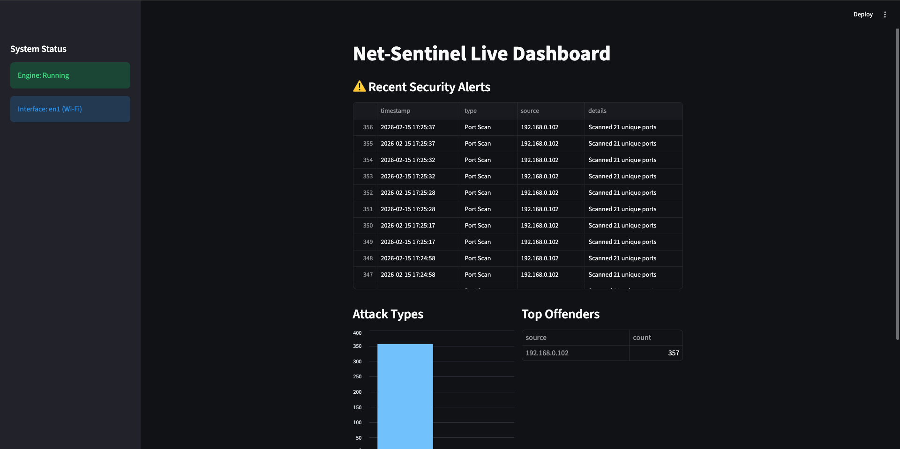

Deep Packet Inspection & Behavioral Threat Detection
Net-Sentinel is a custom-built Network Intrusion Detection System (NIDS) designed to provide real-time visibility into network traffic and immediate alerting for malicious activity. By combining Signature-Based Matching with Heuristic Behavioral Analysis, it effectively identifies reconnaissance and exploitation attempts.

Key Features
Live Packet Sniffing: Real-time ingestion of IPv4 traffic using Layer-2 promiscuous mode.

Behavioral Engine: Heuristic detection of SYN Floods and Port Scans by tracking connection states.

Signature Engine: High-speed payload inspection against custom-defined JSON attack patterns (SQLi, XSS, Path Traversal).

Interactive Dashboard: Live visualization of attack statistics, top offenders, and DNS query history.

Technical Architecture
Net-Sentinel is built on a three-tier architecture designed for efficiency and clarity:

The Sensor (Scapy): Captures raw packets directly from the network interface.

The Processor (Python): Decodes protocols and applies detection logic across multiple threads.

The Interface (Streamlit): Serves a real-time UI that reads from the JSON-log pipeline.

